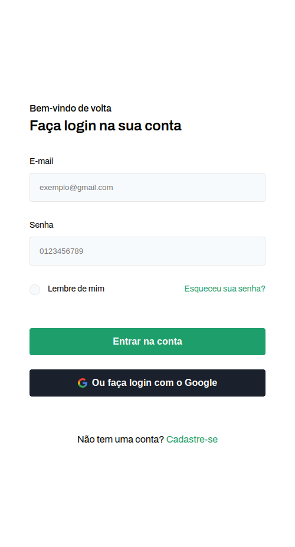
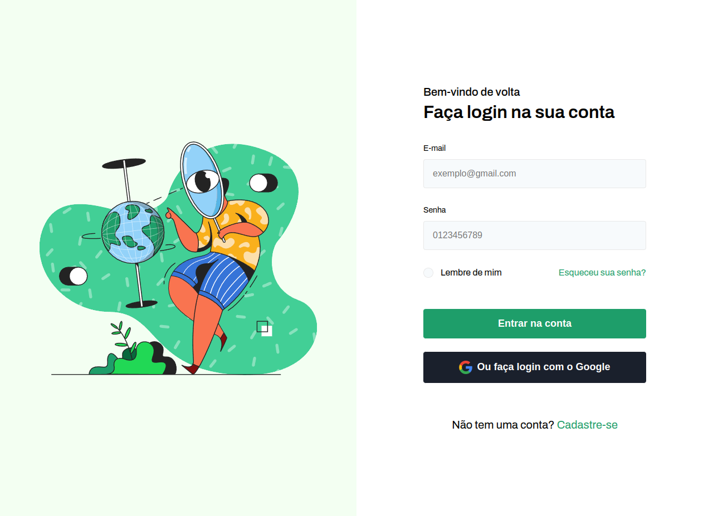

# Desafio 001

## Descrição
Este repositório contém a solução para o **Desafio 001**. O objetivo do desafio é [breve descrição do objetivo do desafio].

## Layout

<a href="assets/img/page-login-mobile.png" target="_blank">
  
</a>

<a href="assets/img/page-login-tablet.png" target="_blank">
  
</a>

<a href="assets/img/login-page-desktop.png" target="_blank">
  
</a>

## Tecnologias Utilizadas
- [Linguagem ou framework principal]
- [Outras ferramentas ou bibliotecas relevantes]

## Como Executar
Siga os passos abaixo para configurar e executar o projeto:

1. Clone o repositório:
   ```sh
   git clone https://github.com/felipeerosdev/desafio-001.git
   ```
2. Acesse o diretório do projeto:
   ```sh
   cd desafio-001
   ```
3. Instale as dependências:
   ```sh
   [comando para instalar dependências, ex: npm install, pip install -r requirements.txt]
   ```
4. Execute o projeto:
   ```sh
   [comando para rodar a aplicação]
   ```

## Estrutura do Projeto
```
/desafio-001
├── src/                # Código-fonte principal
├── tests/              # Testes automatizados
├── docs/               # Documentação adicional
├── .gitignore          # Arquivos ignorados pelo Git
├── README.md           # Documentação principal
└── [outros arquivos relevantes]
```

## Testes
Para executar os testes automatizados, utilize o seguinte comando:
```sh
[comando para rodar os testes]
```

## Contribuição
Se desejar contribuir com este projeto:
1. Faça um fork do repositório.
2. Crie uma nova branch com sua feature ou correção:
   ```sh
   git checkout -b minha-feature
   ```
3. Faça commit das suas alterações:
   ```sh
   git commit -m "Descrição da minha feature"
   ```
4. Envie para o repositório remoto:
   ```sh
   git push origin minha-feature
   ```
5. Abra um Pull Request.

## Contato
Caso tenha dúvidas ou sugestões, sinta-se à vontade para entrar em contato:
- **Felipe Eros**
- GitHub: [@felipeerosdev](https://github.com/felipeerosdev)
- Email: [seu-email-aqui]

---

Feito por Anderson Felipe. 🚀

